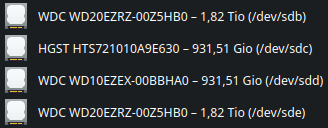
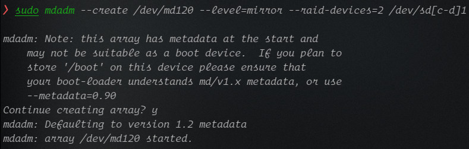
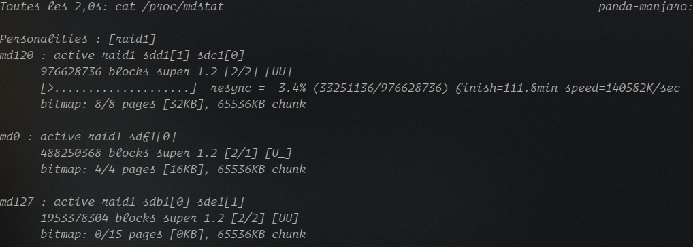

# Créer un RAID 1 chiffré

## Mdadm

Installer mdadm si il n'est pas disponible et activer le service.

```shell
systemctl start mdadm
```

```shell
systemctl enable mdadm
```

## Preparer les disques

Avec un gestionnaire de partitions, chiffrer et creer les partitions sur les disques.

```shell
# Affiche les disques
fdisk -l
```



## Créer le raid

Dans l'exemple, lancer la commande en choisissant le nom du raid `/dev/md***`.

```shell
sudo mdadm --create /dev/md120 --level=mirror --raid-devices=2 /dev/sd[c-d]1
```



Ensuite, la synchronisation des disques s'effectue.

```shell
# Pour voir l'avancement
watch cat /proc/mdstat
```



```shell
# Pour voir les details du raid
sudo mdadm --detail /dev/md120
```

## Monter automatiquement le raid

Dans le fichier `/etc/fstab` ajouter une ligne a la fin du fichier avec les bonnes options :

```shell
# /etc/fstab: static file system information.
#
# Use 'blkid' to print the universally unique identifier for a device; this may
# be used with UUID= as a more robust way to name devices that works even if
# disks are added and removed. See fstab(5).
#
# <file system>             <mount point>  <type>  <options>  <dump>  <pass>
UUID=E799-2B00                            /boot/efi      vfat    umask=0077 0 2
/dev/mapper/luks-7a4ad3ac-f22f-4567-9a1d-07d7b2e38178 /              ext4    defaults,noatime 0 1
/dev/md120 /run/media/panda/d5afc656-bc4a-4b1a-800b-d24f2bb7bc9c ext4 defaults,nofail,discard 0 0
```

## En cas de panne d’un disque dur

Identifier le disque defaillant avec un SMART et le remplacer par un disque fonctionnel de la même taille.
Il faut ensuite créé une nouvelle table de partition avec un seule partition non formatée, exactement comme si vous devez créer un RAID avec ce disque.

Ajouter le disque dans le RAID voulu `/dev/md***` :

```shell
sudo mdadm --manage /dev/md0 --add /dev/sdc1
```
